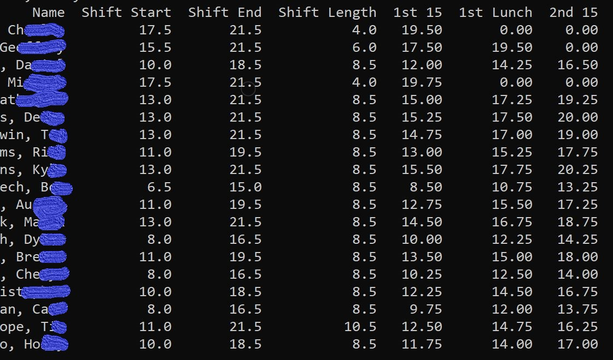

# Break Scheduler

At my job at REI our Sales leads spend 30-45 minutes every morning to create the break schedule so I figured I could create a tool to take the work out of it. 

## Use

Download the days lineup from teams and put it in the same folder as makebreak.py.

Execute in command shell. Must have python installed.

```
python makebreak.py 5.26.21.xlsm
```

